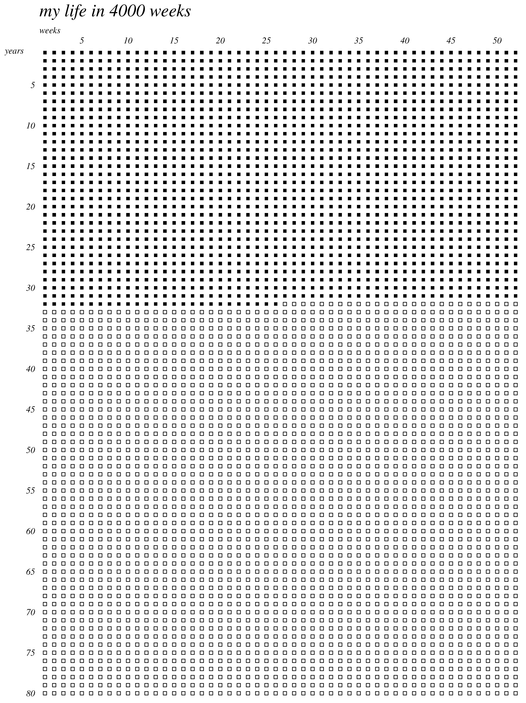
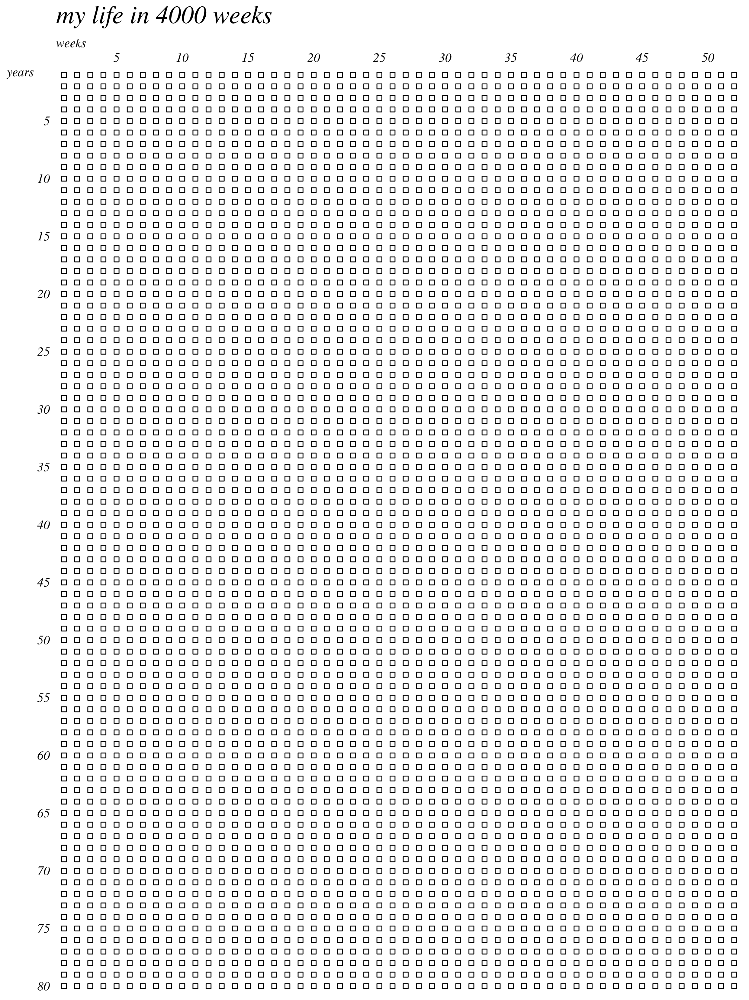

<!-- README.md is generated from README.Rmd. Please edit that file -->

# calendar4kweeks

<!-- badges: start -->

[](https://lifecycle.r-lib.org/articles/stages.html#stable)
[](https://codecov.io/gh/tilschuenemann/calendar4kweeks?branch=master)
[](https://github.com/tilschuenemann/calendar4kweeks/actions)

<!-- badges: end -->

calendar4kweeks is a R+ggplot2 clone of the [4k weeks
calendar](https://4kweeks.com/).

This program creates a calendar; mapping each year and week of an 80
year lifespan and filling in the passed time.

### Usage

``` r
library("calendar4kweeks")

create_calendar(as.Date("1990-01-01"))
```

> 

### Saving plot to disc

If you want to save your plot to your disc, use ggsave as a start:

``` r
library("calendar4kweeks")

myplot <- create_calendar(as.Date("1990-01-01"))

ggplot2::ggsave(myplot,
                filename = "4kweeks.png",
                width = 21,
                height = 29,
                units = "cm",
                device = "png",
                limitsize = F)
```

### Empty calendar

In case you want to create an empty calendar, just fill in todays date:

``` r
library("calendar4kweeks")
myplot <- create_calendar(lubridate::today())
```

> 

You could use this picture for printing or generate one yourself. For
more details take a loot at
[ggsave](https://ggplot2.tidyverse.org/reference/ggsave.html).
